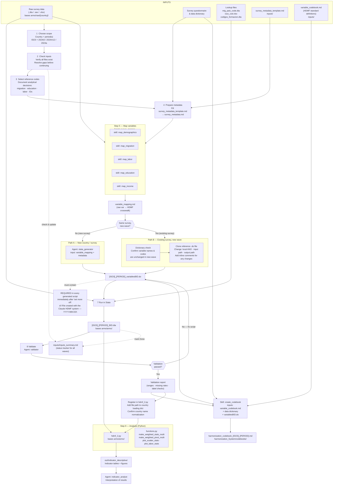
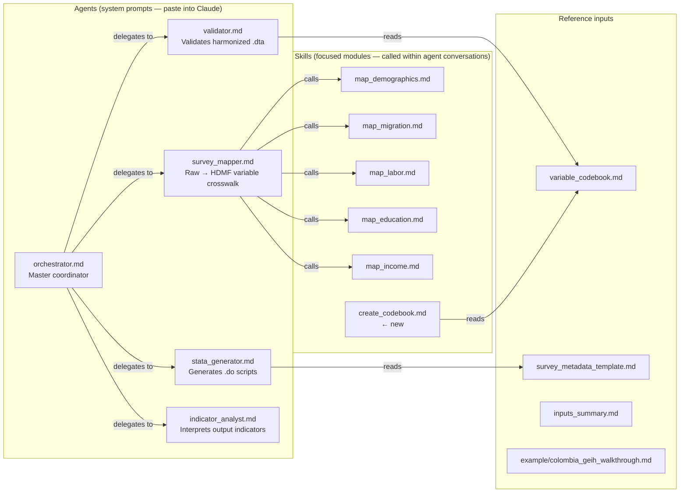
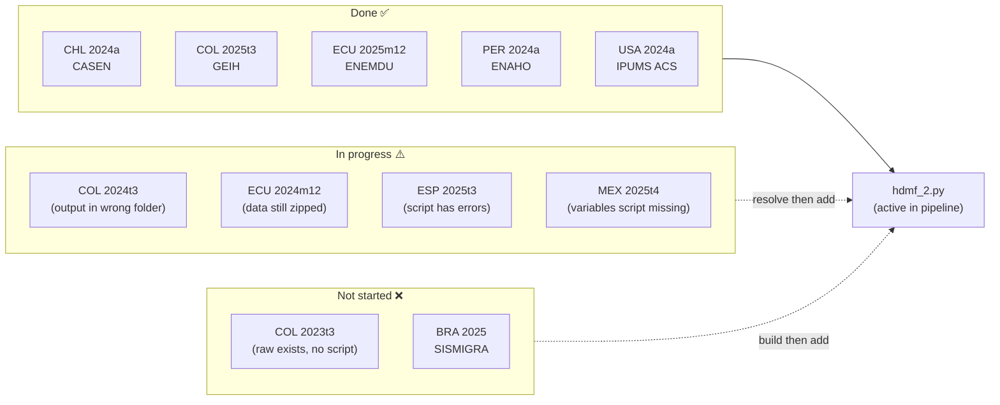

# HDMF Harmonization System — Workflow Diagram

## Full pipeline

```mermaid
flowchart TD

    %% ─────────────────────────────────────────────
    %% INPUTS
    %% ─────────────────────────────────────────────
    subgraph INPUTS["INPUTS"]
        RAW["Raw survey data\n(.dta / .sav / .xlsx)\nbases armo/raw/[country]/"]
        DICT["Survey questionnaire\n& data dictionary"]
        LOOKUP["Lookup files\nmig_pais_code.dta\nciuo_cod.xlsx\ncodigos_formacion.dta"]
        META_TPL["survey_metadata_template.md\ninputs/"]
        CODEBOOK_STD["variable_codebook.md\n(HDMF standard definitions)\ninputs/"]
    end

    %% ─────────────────────────────────────────────
    %% STEP 1-3: SCOPE & DECISIONS
    %% ─────────────────────────────────────────────
    S1["1  Choose scope\nCountry + period(s)\nISO3 + 2024t3 / 2024m12 / 2024a"]
    S2["2  Check inputs\nVerify all files exist\nResolve gaps before continuing"]
    S3["3  Select reference codes\nDocument analytical decisions:\nmigration · education · labor · IDs"]

    INPUTS --> S1
    S1 --> S2
    S2 --> S3

    %% ─────────────────────────────────────────────
    %% STEP 4: METADATA
    %% ─────────────────────────────────────────────
    S4["4  Prepare metadata\nFill survey_metadata_template.md\n→ survey_metadata.md"]
    META_TPL --> S4
    DICT --> S4
    S3 --> S4

    %% ─────────────────────────────────────────────
    %% STEP 5: VARIABLE MAPPING
    %% ─────────────────────────────────────────────
    subgraph MAP["Step 5 — Map variables\nAgent: survey_mapper"]
        SK_DEM["skill: map_demographics"]
        SK_MIG["skill: map_migration"]
        SK_LAB["skill: map_labor"]
        SK_EDU["skill: map_education"]
        SK_INC["skill: map_income"]
    end

    S4 --> MAP
    RAW --> MAP
    MAP --> VARMAP["variable_mapping.md\n(raw var → HDMF crosswalk)"]

    %% ─────────────────────────────────────────────
    %% STEP 6: GENERATE STATA SCRIPT
    %% ─────────────────────────────────────────────
    VARMAP --> S6_Q{{"Same survey,\nnew wave?"}}

    subgraph PATH_A["Path A — New country / survey"]
        A1["Agent: stata_generator\ninput: variable_mapping + metadata"]
    end

    subgraph PATH_B["Path B — Existing survey, new wave"]
        B1["Dictionary check\nConfirm variable names & codes\nare unchanged in new wave"]
        B2["Clone reference .do file\nChange: local ANO · input path · output path\nAdd inline comments for any changes"]
        B1 --> B2
    end

    S6_Q -- "No (new survey)" --> PATH_A
    S6_Q -- "Yes (existing survey)" --> PATH_B

    PATH_A --> DOFILE["[ISO3]_[PERIOD]_variablesBID.do"]
    PATH_B --> DOFILE

    NOTE_DI["REQUIRED in every generated script\nimmediately after 'set more off':\ndi \"File created with the Claude HDMF system — YYYY-MM-DD\""]
    DOFILE -. "must contain" .-> NOTE_DI

    %% ─────────────────────────────────────────────
    %% STEP 7: RUN IN STATA
    %% ─────────────────────────────────────────────
    DOFILE --> S7["7  Run in Stata"]
    RAW --> S7
    LOOKUP --> S7
    S7 --> DTA["[ISO3]_[PERIOD]_BID.dta\nbases armo/armo/"]

    %% ─────────────────────────────────────────────
    %% STEP 8: VALIDATE
    %% ─────────────────────────────────────────────
    DTA --> S8["8  Validate\nAgent: validator"]
    S8 --> VAL_OK{{"Validation\npassed?"}}
    VAL_OK -- "No — fix script" --> DOFILE
    VAL_OK -- "Yes" --> VAL_RPT["Validation report\n(ranges · missing rates · label checks)"]

    %% ─────────────────────────────────────────────
    %% CODEBOOK (new skill)
    %% ─────────────────────────────────────────────
    VAL_RPT --> S_CB["Skill: create_codebook\ninputs: variable_codebook.md\n+ data dictionary\n+ variablesBID.do"]
    CODEBOOK_STD --> S_CB
    DICT --> S_CB
    DOFILE --> S_CB
    S_CB --> CB_OUT["harmonization_codebook_[ISO3]_[PERIOD].md\nharmonization_System/codebooks/"]

    %% ─────────────────────────────────────────────
    %% STEP 8b: REGISTER IN PIPELINE
    %% ─────────────────────────────────────────────
    VAL_RPT --> REG["Register in hdmf_2.py\nAdd file path to country loading dict\nConfirm country name normalization"]

    %% ─────────────────────────────────────────────
    %% STEP 9: ANALYSIS
    %% ─────────────────────────────────────────────
    DTA --> PY["hdmf_2.py\nbases armo/armo/"]
    REG --> PY

    subgraph ANALYSIS["Step 9 — Analysis (Python)"]
        PY
        FUNCS["functions.py\nmake_weighted_stats_multi\nmake_weighted_pivot_multi\nplot_scatter_stats · plot_labor_stats"]
    end

    PY --> OUT["out/indicator_descriptive/\nIndicator tables + figures"]
    OUT --> S9_INT["Agent: indicator_analyst\nInterpretation of results"]

    %% ─────────────────────────────────────────────
    %% INPUTS SUMMARY (status tracker)
    %% ─────────────────────────────────────────────
    STATUS["inputs/inputs_summary.md\n(status tracker for all waves)"]
    S2 -. "check & update" .-> STATUS
    DTA -. "mark Done" .-> STATUS
```

---

## Agents and skills reference

```mermaid
flowchart LR

    subgraph AGENTS["Agents (system prompts — paste into Claude)"]
        ORC["orchestrator.md\nMaster coordinator"]
        SM["survey_mapper.md\nRaw → HDMF variable crosswalk"]
        SG["stata_generator.md\nGenerates .do scripts"]
        VAL["validator.md\nValidates harmonized .dta"]
        IA["indicator_analyst.md\nInterprets output indicators"]
    end

    subgraph SKILLS["Skills (focused modules — called within agent conversations)"]
        DEM["map_demographics.md"]
        MIG["map_migration.md"]
        LAB["map_labor.md"]
        EDU["map_education.md"]
        INC["map_income.md"]
        CB["create_codebook.md\n← new"]
    end

    subgraph INPUTS2["Reference inputs"]
        VC["variable_codebook.md"]
        SMT["survey_metadata_template.md"]
        ISS["inputs_summary.md"]
        EX["example/colombia_geih_walkthrough.md"]
    end

    ORC -- "delegates to" --> SM
    ORC -- "delegates to" --> SG
    ORC -- "delegates to" --> VAL
    ORC -- "delegates to" --> IA

    SM -- "calls" --> DEM
    SM -- "calls" --> MIG
    SM -- "calls" --> LAB
    SM -- "calls" --> EDU
    SM -- "calls" --> INC

    VAL -- "reads" --> VC
    CB -- "reads" --> VC
    SG -- "reads" --> SMT
```

---

## Country-year status

```mermaid
flowchart LR

    subgraph DONE["Done ✅"]
        CHL["CHL 2024a\nCASEN"]
        COL25["COL 2025t3\nGEIH"]
        ECU25["ECU 2025m12\nENEMDU"]
        PER["PER 2024a\nENAHO"]
        USA["USA 2024a\nIPUMS ACS"]
    end

    subgraph WIP["In progress ⚠️"]
        COL24["COL 2024t3\n(output in wrong folder)"]
        ECU24["ECU 2024m12\n(data still zipped)"]
        ESP["ESP 2025t3\n(script has errors)"]
        MEX["MEX 2025t4\n(variables script missing)"]
    end

    subgraph TODO["Not started ❌"]
        COL23["COL 2023t3\n(raw exists, no script)"]
        BRA["BRA 2025\nSISMIGRA"]
    end

    DONE --> PY2["hdmf_2.py\n(active in pipeline)"]
    WIP -. "resolve then add" .-> PY2
    TODO -. "build then add" .-> PY2
```
