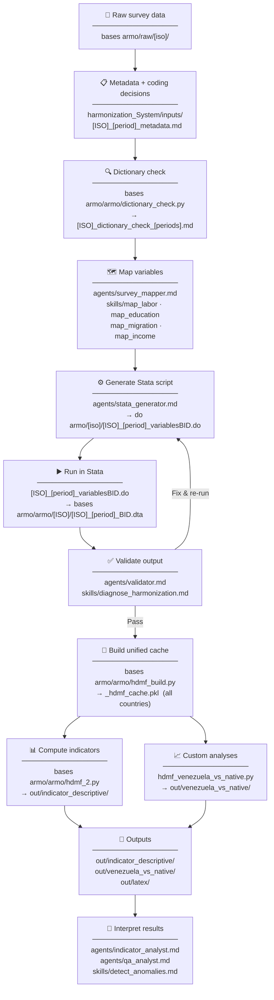
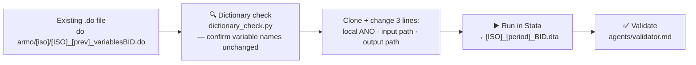

# HDMF — Simple Workflow

---

## Same survey, new wave (fast path)

---

## Key scripts at a glance

| Script | Location | Role |
|--------|----------|------|
| `dictionary_check.py` | `bases armo/armo/` | Checks variable existence across waves before harmonization |
| `[ISO]_[period]_variablesBID.do` | `do armo/[iso]/` | Stata harmonization — produces `_BID.dta` |
| `hdmf_build.py` | `bases armo/armo/` | Merges all `_BID.dta` files into `_hdmf_cache.pkl` |
| `hdmf_2.py` | `bases armo/armo/` | Computes weighted indicators, writes trend tables + charts |
| `hdmf_venezuela_vs_native.py` | `bases armo/armo/` | Venezuela vs. native pooled chart + Excel export |
| `functions.py` | `bases armo/armo/` | Shared helpers: `wavg`, `make_weighted_stats_multi`, plot functions |

---

## Country status

| Status | Countries |
|--------|-----------|
| Done | CHL 2024a · COL 2025t3 · ECU 2025m12 · PER 2024a · USA 2024a |
| In progress | COL 2024t3 · ECU 2024m12 · ESP 2025t3 · MEX 2025t4 |
| Not started | COL 2023t3 · BRA 2025 |
